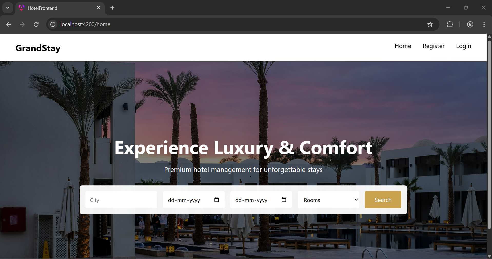
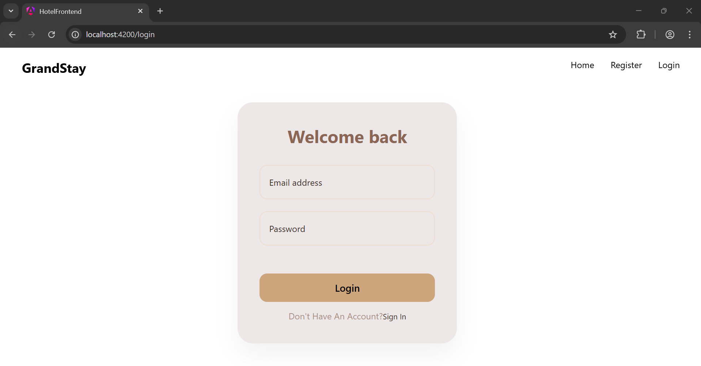
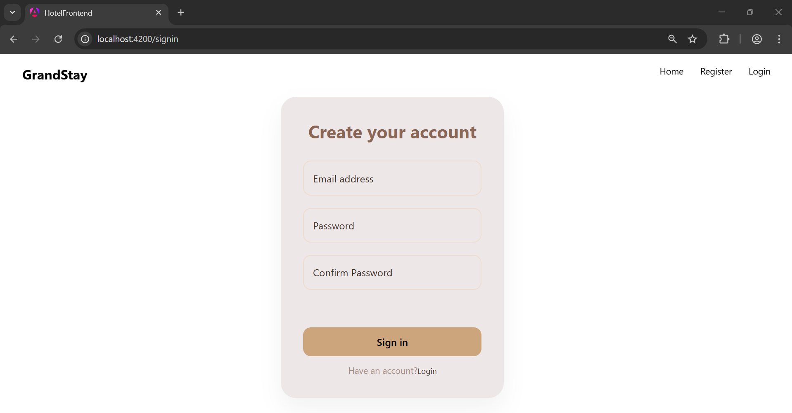

# Hotel Frontend

A modern frontend application for hotel management built with Angular. This application provides role-based dashboards for administrators, managers, receptionists, and users to efficiently manage hotel operations, bookings, and user interactions.

## Features

- **User Authentication**: Secure login and sign-in functionality for different user roles.
- **Role-Based Dashboards**:
  - **Admin Dashboard**: Oversee overall hotel operations and management.
  - **Manager Dashboard**: Handle managerial tasks and oversight.
  - **Reception Dashboard**: Manage check-ins, check-outs, and guest services.
  - **User Dashboard**: Allow guests to view and manage their bookings and profiles.
- **Hotel Listings**: Browse and view available hotels.
- **Room Management**: Display and manage room details and availability.
- **Booking Services**: Handle reservations and booking processes.
- **Profile Management**: User profile updates and password management.
- **Responsive Design**: Optimized for various devices with a clean, intuitive UI.

## User Roles and Permissions

### Administrator
- **View and Manage Hotels**: Add new hotels with details like name, city, address, and room count. View a list of all hotels including their status.
- **Assign Managers**: Add managers to specific hotels by providing their email and password.
- **Delete Hotels**: Remove hotels from the system (except inactive ones).

### Manager
- **Room Management**: Add new rooms specifying room number, type (Single, Double, Deluxe, Suite), status (Available, Occupied, Maintenance), and price.
- **View Rooms**: Access a table of all rooms with their details.
- **Assign Receptionists**: Register new receptionists for the hotel.
- **Monitor Bookings**: View booked rooms with guest details, check-in/out dates, and status.
- **Booking Analytics**: Review month-wise and year-wise booking summaries including total bookings and revenue.

### Receptionist
- **Search Availability**: Find available rooms based on check-in and check-out dates.
- **Book Rooms**: Reserve rooms for guests by entering customer email and name, calculating total price.
- **View All Rooms**: See the status of all rooms in the hotel.
- **Manage Bookings**: View booked rooms and perform check-in and check-out operations.

### Guest (User)
- **View Bookings**: See a list of their bookings including room details, dates, price, and status.
- **Modify Bookings**: Change check-in and check-out dates for existing bookings.
- **Cancel Bookings**: Cancel bookings that are in 'BOOKED' status.

## Screenshots






## Prerequisites

Before running this project, ensure you have the following installed:

- [Node.js](https://nodejs.org/) (version 18 or higher)
- [Angular CLI](https://angular.dev/tools/cli) (version 21 or higher)
- npm (comes with Node.js)

## Installation

1. Clone the repository:
   ```bash
   git clone <repository-url>
   cd hotel-frontend
   ```

2. Install dependencies:
   ```bash
   npm install
   ```

## Usage

1. Start the development server:
   ```bash
   npm start
   # or
   ng serve
   ```

2. Open your browser and navigate to `http://localhost:4200/`.

The application will automatically reload when you make changes to the source files.

## Development

### Code Scaffolding

To generate a new component, run:
```bash
ng generate component component-name
```

For a complete list of available schematics, run:
```bash
ng generate --help
```

### Building

To build the project for production, run:
```bash
ng build
```

The build artifacts will be stored in the `dist/` directory.

### Running Tests

- **Unit Tests**: Execute unit tests with Vitest:
  ```bash
  ng test
  ```

- **End-to-End Tests**: Run e2e tests (if configured):
  ```bash
  ng e2e
  ```

## Technologies Used

- **Angular**: Framework for building the application.
- **TypeScript**: Programming language.
- **RxJS**: Reactive programming library.
- **Vitest**: Testing framework.
- **Prettier**: Code formatter.

